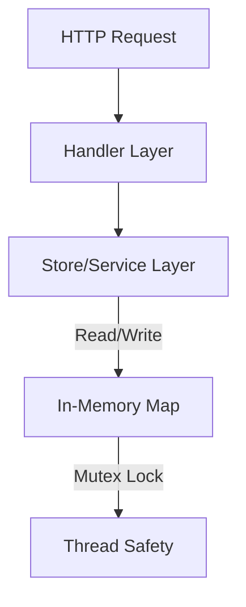

# System Architecture

This document outlines the architectural decisions for **LearnGoFlutter**. It is designed to be a reference for how to structure modern, scalable applications using these technologies.

## High-Level Overview

The application follows a standard **Client-Server** model.

```mermaid
graph LR
    User[User Interaction] --> Flutter[Flutter App (Client)]
    Flutter -- JSON / HTTP --> Go[Go Backend (Server)]
    Go --> Memory[In-Memory Store]
```

---

## 1. Frontend Architecture (Flutter)

We use the **MVVM (Model-View-ViewModel)** pattern. This separates business logic from UI code, making the app easier to test and maintain.

### Layers

1.  **Model**: Pure Dart data classes (e.g., `Note`). They know nothing about widgets or API.
    *   *Responsibility*: Data structure, JSON serialization (`fromJson`, `toJson`).
2.  **View**: The UI (Widgets).
    *   *Responsibility*: Rendering the interface, capturing user input.
    *   *Constraint*: Views *never* contain business logic. They only call methods on the ViewModel.
3.  **ViewModel** (Provider): The bridge between View and Model.
    *   *Responsibility*: Managing state (e.g., `isLoading`, `List<Note>`), calling APIs, notifying the View when data changes.

### Diagram
```mermaid
graph TD
    View[View (UI Widgets)] -->|Calls methods| ViewModel[ViewModel (Provider)]
    ViewModel -->|Notifies changes| View
    ViewModel -->|Fetches Data| API[API Service]
    API -->|Returns| Model[Model (Data Classes)]
    Model --> ViewModel
```

---

## 2. Backend Architecture (Go)

We use a **Layered Architecture** (often called "Clean" or "Hexagonal" simplified). This ensures the business logic works independently of the HTTP delivery mechanism.

### Layers

1.  **Transport Layer (`handlers`)**:
    *   *Responsibility*: Decoding HTTP requests, Encoding JSON responses, Validating inputs.
    *   *Constraint*: Should not contain core business logic.
2.  **Service/Store Layer (`store`)**:
    *   *Responsibility*: Managing the data. In this app, it's a thread-safe in-memory map protected by a `sync.RWMutex`.
    *   *Why Mutex?*: Go web servers are concurrent. Multiple requests can hit the server at the exact same nanosecond. Without a Mutex, reading/writing to a map simultaneously causes a **Race Condition** and crashes the app.
3.  **Domain Layer (`models`)**:
    *   *Responsibility*: Core struct definitions used by both layers.

### Diagram


---

## 3. Communication

The two worlds speak to each other via **JSON over HTTP**.

*   **Endpoint**: `http://localhost:8080` (or your machine's IP for real devices).
*   **Format**:
    *   **GET /notes** -> Returns `[ { "id": "1", "title": "..." } ]`
    *   **POST /notes** -> Accepts `{ "title": "...", "body": "..." }`

### Error Handling Protocol
*   **Success**: `200 OK` or `201 Created` with JSON body.
*   **Client Error**: `400 Bad Request` (e.g., missing title).
*   **Server Error**: `500 Internal Server Error`.

The Flutter `ApiService` catches these status codes and throws customized Dart Exceptions (e.g., `HttpException`) that the UI can catch and display as Snackbars.
